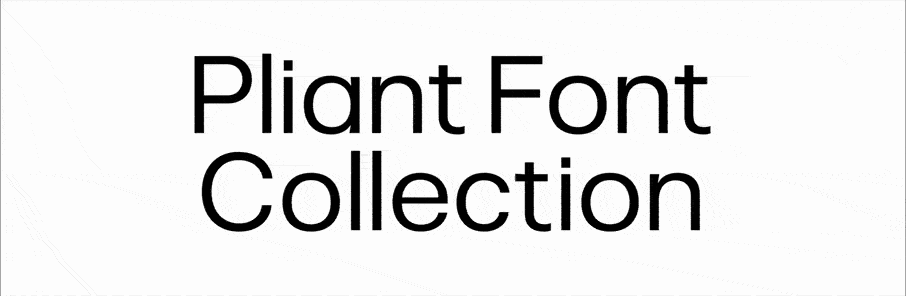
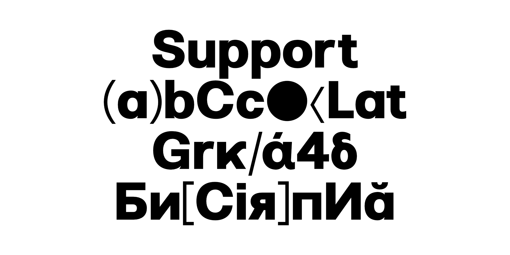
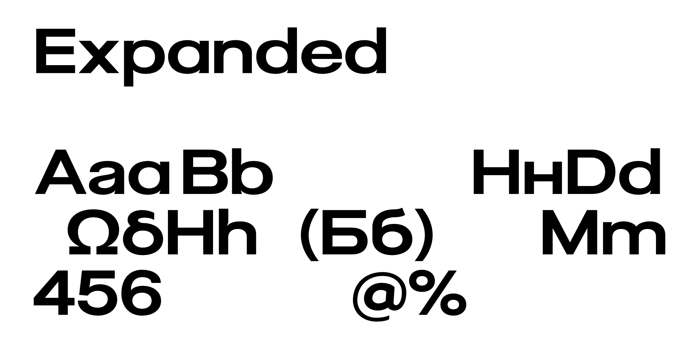

# Pliant

[![][Fontspector]](https://googlefonts.github.io/googlefonts-project-template/fontspector/fontspector-report.html)
[![][OpenType]](https://googlefonts.github.io/googlefonts-project-template/fontspector/fontspector-report.html)
[![][Universal]](https://googlefonts.github.io/googlefonts-project-template/fontspector/fontspector-report.html)
[![][Google Fonts]](https://googlefonts.github.io/googlefonts-project-template/fontspector/fontspector-report.html)
[![][Glyphset]](https://googlefonts.github.io/googlefonts-project-template/fontspector/fontspector-report.html)

[Fontspector]: https://img.shields.io/endpoint?url=https%3A%2F%2Fgooglefonts.github.io%2Fgooglefonts-project-template%2Fbadges%2FFontspectorQA.json
[OpenType]: https://img.shields.io/endpoint?url=https%3A%2F%2Fgooglefonts.github.io%2Fgooglefonts-project-template%2Fbadges%2FOpentypeSpecificationChecks.json
[Universal]: https://img.shields.io/endpoint?url=https%3A%2F%2Fgooglefonts.github.io%2Fgooglefonts-project-template%2Fbadges%2FUniversalProfileChecks.json
[Google Fonts]: https://img.shields.io/endpoint?url=https%3A%2F%2Fgooglefonts.github.io%2Fgooglefonts-project-template%2Fbadges%2FFontFileChecks.json
[Outline Correctness]: https://img.shields.io/endpoint?url=https%3A%2F%2Fgooglefonts.github.io%2Fgooglefonts-project-template%2Fbadges%2FOutlineCorrectnessChecks.json
[Glyphset]: https://img.shields.io/endpoint?url=https%3A%2F%2Fgooglefonts.github.io%2Fgooglefonts-project-template%2Fbadges%2FGlyphsetChecks.json

Pliant is a variable sans-serif designed for flexibility across editorial, branding, and interface environments. Pliant was designed as a versatile system capable of adapting across multiple typographic environments while maintaining consistency, clarity, and rhythm.

The family explores spatial flexibility through proportional changes ranging from compact to expanded compositions. Supporting Latin, Greek, and Cyrillic scripts, the family combines weight and width variation within a contemporary typographic system.

Pliant includes support for upright and italic styles, variable weight and width axes, and a multilingual character set containing more than 1,020 glyphs.

## Features

- Variable font
- Weight axis (`wght`)
- Width axis (`wdth`)
- Upright and italic styles
- Latin support
- Greek support
- Cyrillic support
- 1,020 glyphs
- Standard ligatures
- Discretionary ligatures
- Alternate glyphs
- Numerators
- Denominators
- Superscripts
- Subscripts
- Fractions

## About

Non Foundry is an independent type foundry based in Monterrey, Mexico. Since 2019, the studio has focused on developing typefaces that balance aesthetics and functionality through contemporary systems and typographic research.

## Building

Fonts are built automatically by GitHub Actions — take a look in the “Actions” tab for the latest build.

If you want to build fonts manually on your own computer:

- `make build` will produce font files.
- `make test` will run FontBakery quality assurance tests.
- `make proof` will generate HTML proof files.

## License

This Font Software is licensed under the SIL Open Font License, Version 1.1.  
This license is available with a FAQ at https://openfontlicense.org